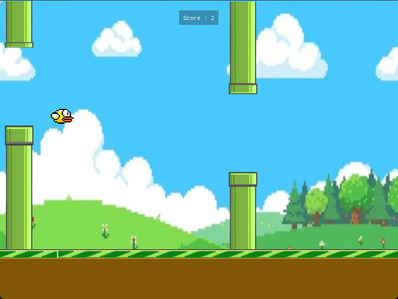

# 🐦 Flappy Bird Engine (C++17 / SDL3)


> **Projet Académique - ENSPY (École Nationale Supérieure Polytechnique de Yaoundé)**
> *Module : Programmation C++ Avancée*

---

## 📸 Aperçu



Ce projet est un moteur de jeu 2D modulaire développé "from scratch". Il implémente une boucle de jeu (Game Loop) optimisée, une gestion de la mémoire RAII et une interface de débogage en temps réel.

---

## 🏗️ Architecture & Interaction des Modules

Le projet suit une architecture stricte où la classe `Game` agit comme le chef d'orchestre (Controller) qui gère les entités (`Bird`, `Pipe`) et la vue (`UI`).

### Diagramme de Flux (Game Loop)
Chaque "Frame" du jeu suit cet ordre d'exécution strict :

1.  **Input** : `Game` capture les entrées (Clavier/Souris) et les envoie à `Bird` (Saut) ou `UI` (Clics).
2.  **Update** : `Game` calcule le temps écoulé (`deltaTime`) et demande à `Bird` et `Pipe` de mettre à jour leur physique.
3.  **Render** : `Game` efface l'écran, dessine le fond, demande à chaque entité de se dessiner, puis affiche l'UI par-dessus.

---

## 📘 Documentation Fonctionnelle

Voici le détail des classes, leurs responsabilités et comment elles interagissent.

### 1. Classe `Game` (Le Moteur)
*C'est le cœur du programme. Elle gère le cycle de vie de l'application.*

| Fonction | Rôle & Interaction |
| :--- | :--- |
| `Game()` (Constructeur) | Initialise SDL3, crée la fenêtre, alloue la mémoire pour `mBird` et charge les textures. |
| `Run()` | Contient la **boucle infinie** `while(mIsRunning)`. Elle appelle séquentiellement `ProcessInput`, `Update` et `GenerateOutput`. |
| `ProcessInput()` | Détecte les touches. Si `Espace` est pressé, appelle `mBird->Jump()`. Si la souris bouge, transmet l'info à `mUI`. |
| `Update(float deltaTime)` | Cerveau physique. Applique la gravité, fait avancer les tuyaux, détecte les collisions (AABB) et gère la machine à états (`mState`). |
| `GenerateOutput()` | Algorithme du peintre : Dessine dans l'ordre (Fond -> Tuyaux -> Sol -> Oiseau -> UI) puis appelle `SDL_RenderPresent`. |
| `RestartGame()` | **Critique pour la mémoire**. Supprime (`delete`) l'oiseau et les tuyaux actuels, puis recrée de nouvelles instances pour remettre le jeu à zéro proprement. |

### 2. Classe `Bird` (Le Joueur)
*Gère la physique et l'affichage du personnage.*

| Fonction | Rôle & Interaction |
| :--- | :--- |
| `Update(float deltaTime)` | Applique la gravité : `mVelocity += GRAVITY * deltaTime`. Modifie la position Y de l'oiseau. |
| `Jump()` | Appelé par `Game` quand le joueur appuie sur Espace. Impulsion négative immédiate (`mVelocity = -500`). |
| `GetHitbox()` | Renvoie un rectangle réduit (Padding) pour rendre les collisions plus justes et agréables ("Fair Play"). |
| `Draw(...)` | Affiche la texture de l'oiseau à sa position actuelle. Contient une sécurité : si la texture manque, dessine un carré jaune. |

### 3. Classe `Pipe` (Les Obstacles)
*Gère le mouvement et la génération procédurale des tuyaux.*

| Fonction | Rôle & Interaction |
| :--- | :--- |
| `Pipe(float startX)` | Génère aléatoirement la hauteur du trou (`mGapY`) via `rand()`. |
| `Update(float deltaTime)` | Déplace le tuyau vers la gauche : `mX -= SPEED * deltaTime`. |
| `Draw(...)` | Dessine deux tuyaux : celui du bas (normal) et celui du haut (inversé via `SDL_FLIP_VERTICAL`). |
| `IsOffScreen()` | Appelé par `Game`. Renvoie `true` si le tuyau est sorti de l'écran. `Game` utilisera cette info pour `delete` le tuyau et libérer la mémoire. |

### 4. Classe `UI` (Interface Utilisateur)
*Gère les menus et l'affichage tête haute (HUD) via ImGui.*

| Fonction | Rôle & Interaction |
| :--- | :--- |
| `Init(...)` / `Shutdown()` | Configure le contexte ImGui et le lie au rendu SDL3. |
| `Draw(...)` | Fonctionne comme une **Machine à États visuelle**. Selon `GameState`, elle dessine le Menu Principal, le Score en jeu, ou l'écran Game Over. |
| **Interactions** | Utilise des références (`bool &restart`, `bool &quit`) pour modifier directement les variables du moteur depuis les boutons de l'interface. |

---

## 📂 Organisation des Fichiers

```text
Flappy_Bird_Project/
│
├── assets/               # Ressources du jeu
│   ├── images/           # (bird.png, pipe.png, background.png...)
│   └── sounds/           # (jump.wav, score.wav, die.wav)
│
├── include/              # En-têtes (.h) - Les "Plans"
│   ├── Game.h            # Moteur principal et boucle de jeu
│   ├── Bird.h            # Classe du joueur
│   ├── Pipe.h            # Classe des obstacles
│   └── UI.h              # Gestion de l'interface ImGui
│
├── src/                  # Sources (.cpp) - La "Logique"
│   ├── Game.cpp          # Implémentation du moteur
│   ├── Bird.cpp          # Physique et rendu de l'oiseau
│   ├── Pipe.cpp          # Mouvement et gestion des tuyaux
│   └── UI.cpp            # Dessin des fenêtres ImGui
│
├── libs/                 # Bibliothèques compilées (.lib/.dll pour SDL3)
├── thirdparty/           # Code externe (fichiers sources d'ImGui)
│
├── build.py              # Script d'automatisation de la compilation (Python)
├── main.cpp              # Point d'entrée du programme (main)
├── highscore.txt         # Fichier de sauvegarde (Généré automatiquement)
├── imgui.ini             # Sauvegarde de la position des fenêtres ImGui
├── LICENSE               # Licence du projet (ex: MIT)
├── README.md             # Documentation du projet
└── Flappy_Bird.exe       # L'exécutable final (Résultat de la compilation)

Voici la fin de ton fichier `README.md` formatée proprement en Markdown, prête à être copiée à la suite du reste.

J'ai ajouté des icônes, des blocs de code et du gras pour rendre le tout très lisible sur GitHub.

---

```markdown
## 🛠️ Compilation (Build System)

Le projet utilise un script Python personnalisé pour garantir la portabilité (**Windows** & **Linux**) sans dépendre d'un IDE spécifique (comme Visual Studio).

**Commande unique pour compiler :**
```bash
python build.py

```

> *Le script détecte automatiquement le système d'exploitation, effectue le linkage des bibliothèques SDL3 et compile le projet avec le standard C++17.*

---

## 🧠 Défis Techniques & Apprentissages

Ce projet a permis de surmonter plusieurs défis d'ingénierie logicielle :

### 1. Gestion Mémoire (RAII)

Le défi principal était d'éviter les fuites de mémoire (Memory Leaks) lors des redémarrages fréquents du jeu.

* **Solution :** Chaque objet alloué dynamiquement avec `new` (exemple : `new Pipe()`) est rigoureusement détruit avec `delete` dans la méthode `RestartGame()` ou dans le destructeur `~Game()`.

### 2. Indépendance du Framerate

Pour éviter que le jeu ne tourne trop vite sur des PC puissants :

* **Solution :** L'utilisation du multiplicateur `deltaTime` dans toutes les méthodes `Update()` garantit que la physique (gravité, vitesse) est identique sur un écran **30Hz** et un écran **144Hz**.

### 3. Communication Inter-Objets

Il fallait connecter l'interface graphique au moteur sans créer de dépendances cycliques.

* **Solution :** La classe `UI` ne "possède" pas le jeu. Elle contrôle le moteur via des **références C++** (`bool &restart`, `bool &quit`), respectant ainsi le principe de séparation des responsabilités.

---

## 👤 Auteur

**NGOMU YONKEU HERVE PAVEL GABRIEL**

* Étudiant Ingénieur - **ENSPY** (École Nationale Supérieure Polytechnique de Yaoundé)
* *Janvier 2026*

---
